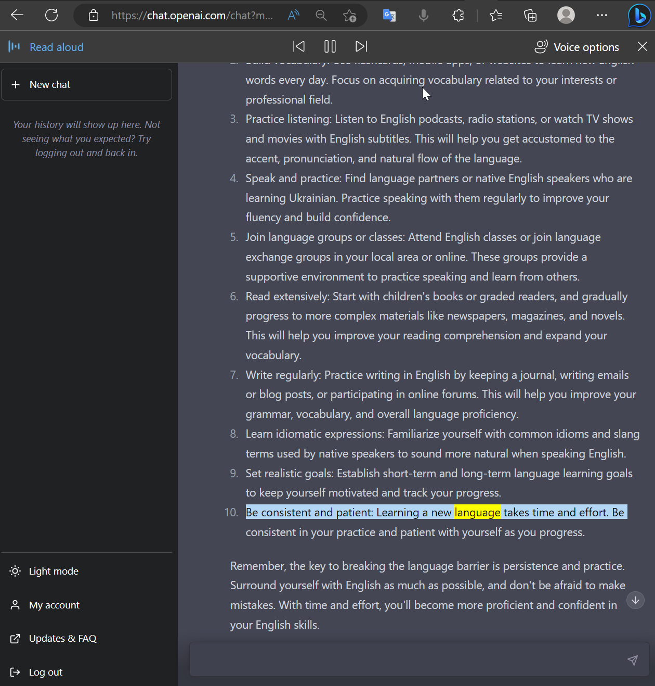

# English B1 in 30 Day's

I will master Englisth till:

`13.04.2022` - Mock examen

## Andrew Loop every day

0. Repeat words from yesterday.
1. Determine new **N** to learn today
3. Make a list of them in file
4. Write them down by hand.
5. Practice speaking and listening with Voice-To-Text and Text-To-Voice 
7. Generate Touch typing execise and do it in stamina.
8. Ask chat-GPT to generate 10 sentence with that word and try to translate it. 
9. Then make 3 sentence with those word's 
10. ‼ Repeat them 10 times a day. In the morning before  the bad and on every break.

## Problem 

- A0 Breaking language barrier
- A1 Vocabulary
- A2 Combining words into sentence.
- B2 Not enough speaking practice.
- C1 Grammatics

## Solution

- A0 Chat-GPT
- A2 Vocabularie building
- A3 Reading/Writing Practice

- B1 English Speaking Club
- B2 English Teacher

## Chat GPT Example

What I need

## CLI commands

### Generating touch tyuping words 

`python .\MakeTouchTyping.py .\Week0.md -o Week0TouchTyping.txt` 

### Counting the words

`python word_counter.py .\PythonCC\SpecializationIntroduction.txt -o PythonCC\SpecializationIntroduction.csv -wc 100`
